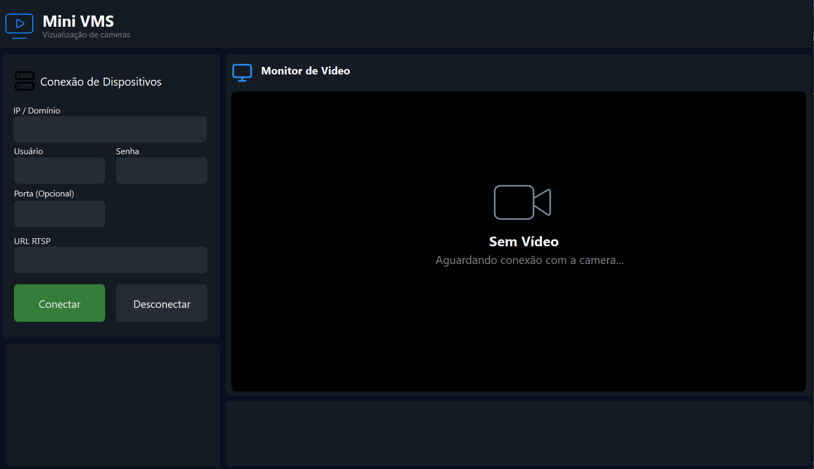

# Simple Mini VMS for Retrieving Images from Cameras

A lightweight Mini VMS built with Delphi for connecting to cameras, displaying streams, and retrieving **images**.

## Screenshot

## Features

- RTSP camera connection
- Live stream visualization
- Image capture
- Lightweight **architecture**
- Easy integration with different camera sources

## Technologies

- Delphi
- VlcVideo
- FFmpeg
- RTSP

## License

MIT